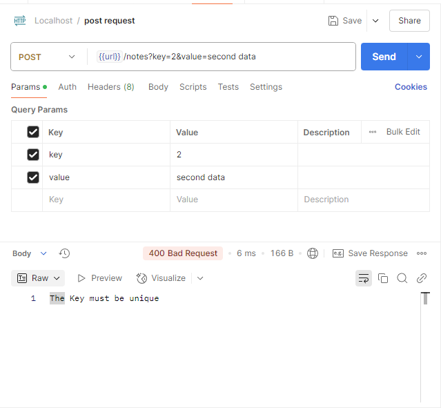
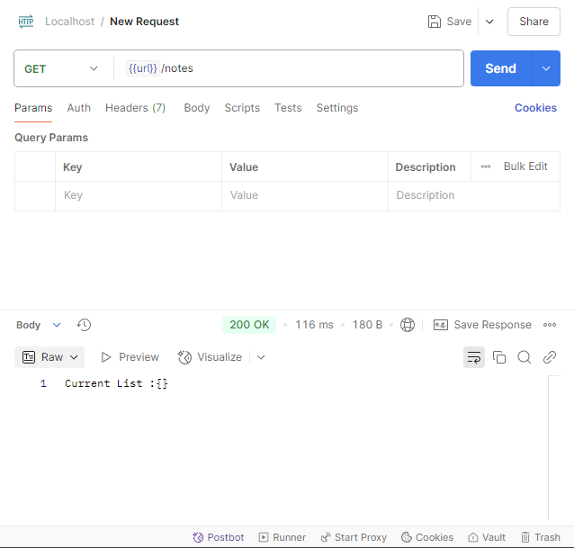
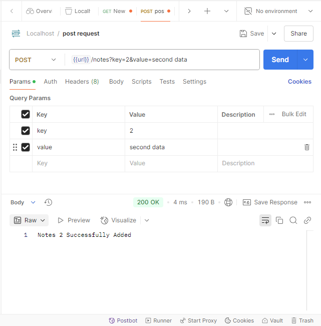
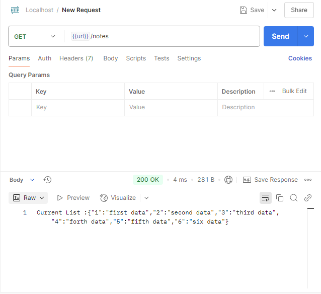

# Astra Spring Boot Rest-API


## Required Software

- [maven](https://maven.apache.org/install.html)

## Development

- Clone this project

```
git clone https://github.com/novalb12/astrapay-spring-boot-external.git
```

- Start web

```
./run
```

and here is the list of API path that can be used

GET /notes : show list of current notes
POST /notes with params key and value : add notes
DELETE /notes with params key : delete notes with key


Here are some example API calls and responses:

### Validation Unique Key Error


### Initial Empty Notes List


### Adding New Notes


### Notes List with 6 Items


